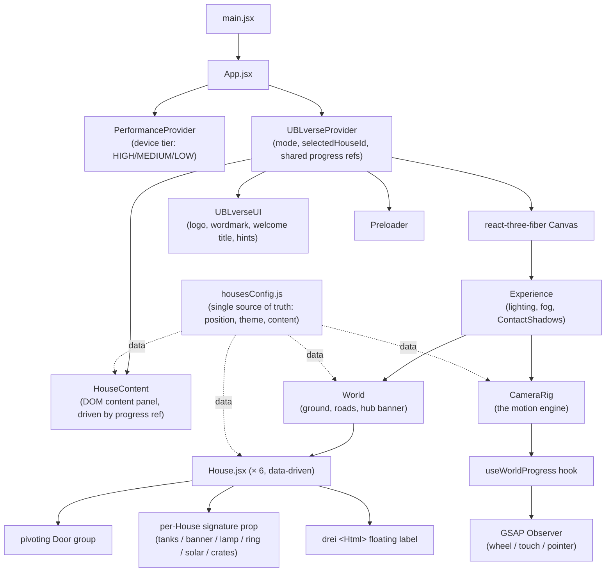
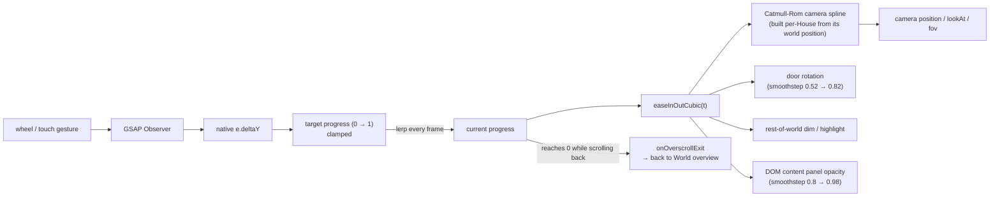
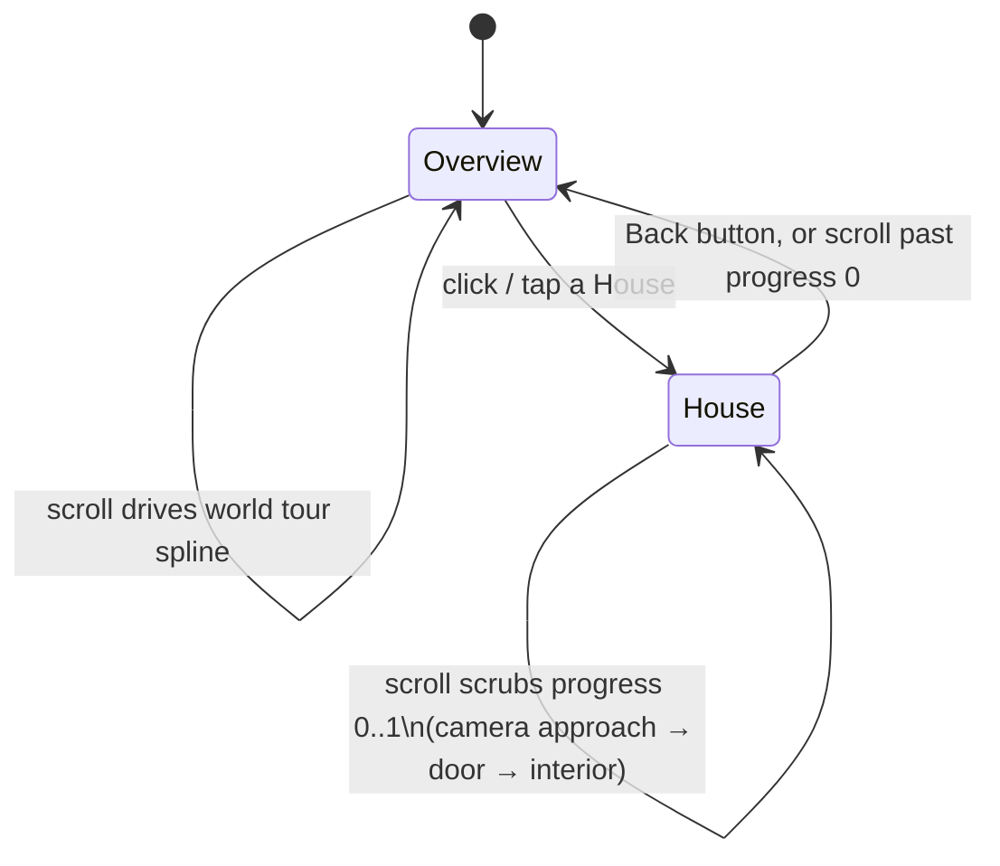

[UBLversearchitecture.md](https://github.com/user-attachments/files/31263884/UBLversearchitecture.md)
# UBLverse: Architecture & Overview

## Repository

- **Source branch:** `Hemashree-UBL-Basic-Wireframe` (pushed to `StepOne-Automation/UI-Wireframe-Mockup---UBL`)
- **Stack:** React 19 + React Three Fiber + Three.js + GSAP + Vite
- **Offline-ready:** all fonts (HEINEKEN Curve) and UBL logos are bundled locally under `public/` — no CDN or network calls at runtime.

## What it is

UBLverse is an interactive 3D world for United Breweries Limited. Instead of a
conventional scrolling webpage, the user lands directly inside a cinematic 3D
map — a central UB hub connected by roads to six "Houses" (Brewery, Brands,
People, Innovation, Sustainability, Distribution). Scrolling drives a
continuous camera journey through the world; clicking a House triggers a
cinematic approach → door opens → camera crosses the threshold → content
reveals, and a Back button reverses the same path.

---

## Component architecture

---

## Scroll-driven motion pipeline

This is the core mechanism reused for both the world "tour" (overview) and
each House's entry/exit sequence — one continuous, reversible progress value
drives every visual layer at once, instead of separate competing animations.

---

## House interaction state machine

---

## Screenshots

See attached image files:

1. **World overview** — the landing world with the "Welcome to The UBLverse" arrival title, six Houses on podiums around the central UB hub.
2. **Scroll-driven world tour** — mid-scroll, camera flying past Brewery/Brands Houses with real parallax (trees, lamp posts, other Houses passing through frame).
3. **Camera approaching a House** — real 3D travel toward the selected House, not a cut or fade.
4. **Inside Brewery House** — authored content panel (heading, stats, back button) in the HEINEKEN Curve font over the interior.
5. **Returning to the overview** — camera settled back after the exit animation.
